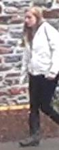
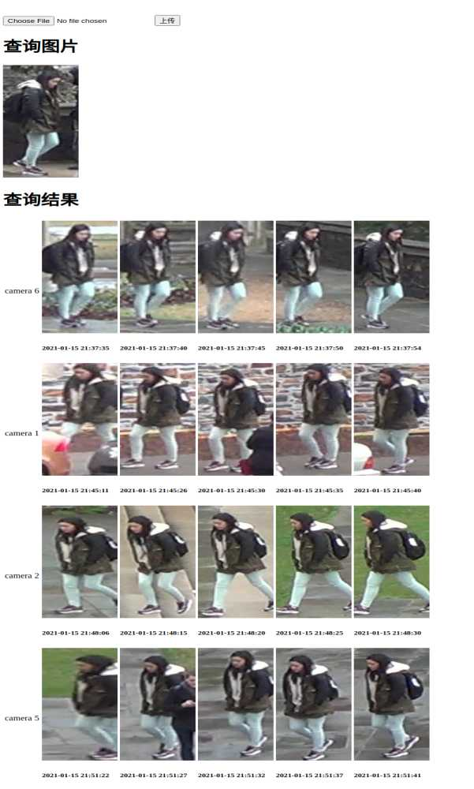
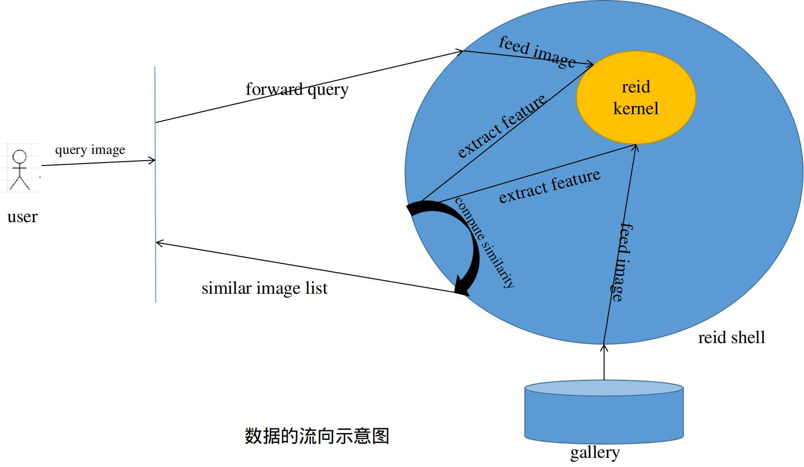

# 一个行人重识别模型应用的Demo
## 场景假设
- 在某公共场所, 一位游客拿着一张照片, 向前台工作人员求助,  想查找照片上的人的位置. 
- 问题抽象一下: 作为用户, 我想要系统根据给定的照片, 去搜索最近一段时间内, 商场所有摄像头下所有疑似同一个人的图像, 包括拍摄的时间和地点. 
- 比如要查询这么一张图片
    - 

## 预期的查询结果
希望返回指定数量的图片, 同时包括图片拍摄的时间和地点, 比如下图中, 返回图片按照camera_id分组, 并按照时间先后排列.   

## 问题的简化和技术栈的选择
- 主要的技术栈
    - flask: 前段框架和web服务器.
    - pytorch: 加载和运转Reid模型.
    - python: 数据处理, 接口实现等.
    - person re-identification(行人重识别)相关技术.

- 由于一些限制, 而且目的是一个demo, 因此我将问题进行了的大幅的简化. 
    1. 图片库是静态的(DukeMTMC-reid: person re-id 的公开数据集), 是固定的抽取自固定的前后间隔85分钟的监控视频.
    2. 图片是已经裁剪好的. 数据的前置处理需要目标检测技术,  需要将一张大图片中包含人物的那个矩形框裁剪出来;
    3. 未考虑模型部署的硬件成本, 我是在自己台式机上测试, 用的是GPU.

- 数据集介绍:
   - 摄像头数量: 8个; 
   - 查询库(gallery): 共17661张图片;
   - 前后跨度85分钟, 每120帧抽取一张图片作为样本;

## 关于系统的构想
- 处理过程大概是如下的步骤
    1. 用户提交查询图片
    2. 前端将图片提交给ReidShell(负责数据的接收与发送, 与数据库的交互, 与ReidKernel的交互)
    3. ReidShell将查询图片"喂"给ReidKernel(就是一个训练好的模型, 只负责提取图片特征), 得到特征向量query_feature
    4. ReidShell将查询库图片(galler)全部"喂"给ReidKernel, 得到一组特征向量gallery_features
    5. ReidShell计算query_feature与gallery_features的相似度, 返回一组排序后的对应的图片列表image_list
    6. 前端将图片列表进行展示

## 可优化的地方
1. 考虑如果gallery是动态变化的怎么办
    - 需要定期更新gallery_features和gallery_image_paths
2. 如何与上游模块更好的结合, 比如目标检测
    - person search 研究方向
3. 是否可精简模型, 使更容易部署, 更节省资源.
    - 模型量化和剪枝
    - 使用c++调用pytorch模型, 可加速.
4. 使用更稳健的web服务器, 比如
    - ngix+gunicorn+flask
